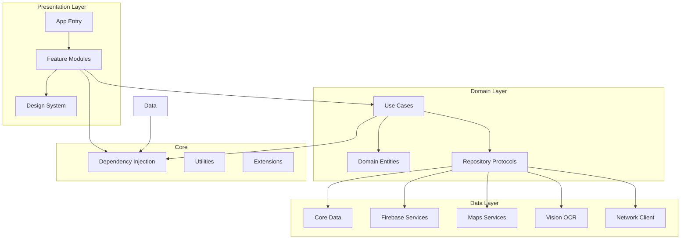
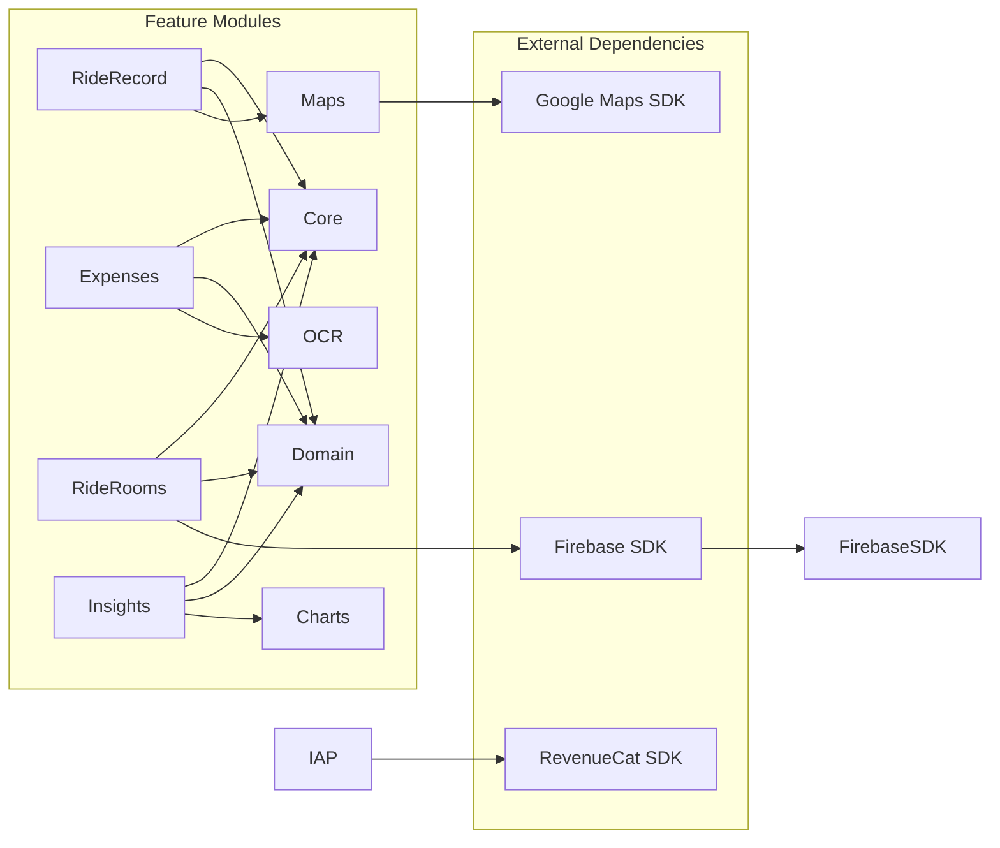
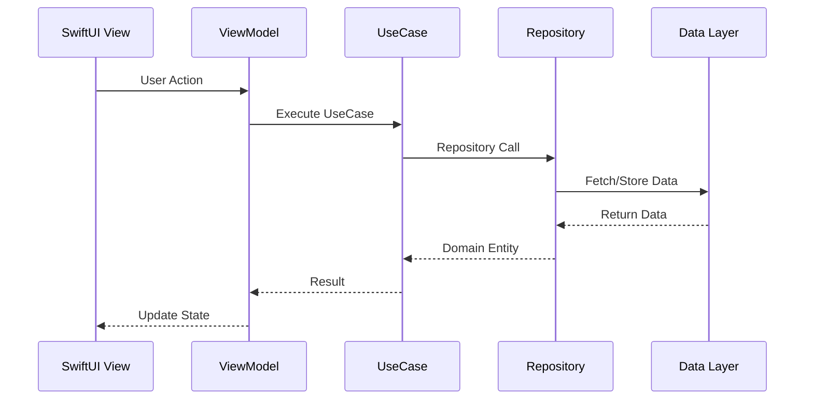

# MotoMitra Architecture

## High-Level Architecture



## Module Structure

```
MotoMitra/
├── App/
│   ├── MotoMitraApp.swift
│   ├── AppDelegate.swift
│   ├── SceneDelegate.swift
│   ├── Info.plist
│   └── Assets.xcassets
│
├── Core/
│   ├── DI/
│   │   ├── Container.swift
│   │   ├── Resolver.swift
│   │   └── Injectable.swift
│   ├── DesignSystem/
│   │   ├── Colors.swift
│   │   ├── Typography.swift
│   │   ├── Spacing.swift
│   │   ├── Components/
│   │   └── Modifiers/
│   ├── Navigation/
│   │   ├── Router.swift
│   │   ├── NavigationPath.swift
│   │   └── Coordinator.swift
│   ├── Utils/
│   │   ├── Extensions/
│   │   ├── Formatters/
│   │   ├── Validators/
│   │   └── Constants.swift
│   └── FeatureFlags/
│       └── FeatureFlags.swift
│
├── Domain/
│   ├── Entities/
│   │   ├── Ride.swift
│   │   ├── Expense.swift
│   │   ├── Vehicle.swift
│   │   ├── RideRoom.swift
│   │   ├── Settlement.swift
│   │   └── POI.swift
│   ├── UseCases/
│   │   ├── RideRecording/
│   │   ├── ExpenseManagement/
│   │   ├── RoomManagement/
│   │   └── VehicleService/
│   └── Repositories/
│       ├── RideRepository.swift
│       ├── ExpenseRepository.swift
│       ├── VehicleRepository.swift
│       └── RoomRepository.swift
│
├── Data/
│   ├── Persistence/
│   │   ├── CoreData/
│   │   │   ├── MotoMitra.xcdatamodeld
│   │   │   ├── CoreDataStack.swift
│   │   │   ├── Migrations/
│   │   │   └── Repositories/
│   │   └── Keychain/
│   │       └── KeychainService.swift
│   ├── Network/
│   │   ├── Firebase/
│   │   │   ├── AuthClient.swift
│   │   │   ├── FirestoreClient.swift
│   │   │   └── StorageClient.swift
│   │   ├── API/
│   │   │   └── NetworkClient.swift
│   │   └── Reachability/
│   ├── Maps/
│   │   ├── GoogleMapsClient.swift
│   │   ├── PlacesClient.swift
│   │   └── LocationManager.swift
│   ├── OCR/
│   │   ├── VisionOCRClient.swift
│   │   ├── FuelReceiptParser.swift
│   │   └── DocumentScanner.swift
│   └── Export/
│       ├── PDFRenderer.swift
│       └── CSVExporter.swift
│
├── Features/
│   ├── Home/
│   │   ├── HomeView.swift
│   │   ├── HomeViewModel.swift
│   │   └── Components/
│   ├── RideRecord/
│   │   ├── RecordView.swift
│   │   ├── RecordViewModel.swift
│   │   ├── PreRideSheet.swift
│   │   ├── PostRideSheet.swift
│   │   ├── AutoDetection/
│   │   └── Components/
│   ├── RideDetail/
│   │   ├── RideDetailView.swift
│   │   ├── RideDetailViewModel.swift
│   │   └── Components/
│   ├── Expenses/
│   │   ├── ExpenseListView.swift
│   │   ├── AddExpenseView.swift
│   │   ├── FuelScannerView.swift
│   │   ├── ExpenseViewModel.swift
│   │   └── OCR/
│   ├── RideRooms/
│   │   ├── RoomListView.swift
│   │   ├── RoomDetailView.swift
│   │   ├── SettlementView.swift
│   │   ├── RoomViewModel.swift
│   │   └── Components/
│   ├── Vehicles/
│   │   ├── VehicleListView.swift
│   │   ├── VehicleDetailView.swift
│   │   ├── VehicleViewModel.swift
│   │   └── Components/
│   ├── Service/
│   │   ├── ServiceListView.swift
│   │   ├── ServiceReminderView.swift
│   │   ├── ServiceViewModel.swift
│   │   └── Components/
│   ├── Documents/
│   │   ├── DocumentVaultView.swift
│   │   ├── DocumentViewModel.swift
│   │   └── Components/
│   ├── POI/
│   │   ├── POIExplorerView.swift
│   │   ├── POIDetailView.swift
│   │   ├── POIViewModel.swift
│   │   └── Components/
│   ├── Insights/
│   │   ├── InsightsView.swift
│   │   ├── InsightsViewModel.swift
│   │   └── Charts/
│   ├── Settings/
│   │   ├── SettingsView.swift
│   │   ├── SettingsViewModel.swift
│   │   └── Components/
│   └── Onboarding/
│       ├── OnboardingView.swift
│       ├── PermissionsView.swift
│       └── Components/
│
├── Resources/
│   ├── Localizable.strings
│   ├── Localizable.strings (hi)
│   └── GoogleService-Info.plist
│
├── Tests/
│   ├── UnitTests/
│   ├── SnapshotTests/
│   └── UITests/
│
└── Configuration/
    ├── Debug.xcconfig
    ├── Release.xcconfig
    └── .env.example
```

## Dependency Graph



## Data Flow

